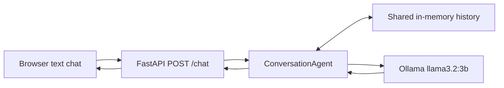
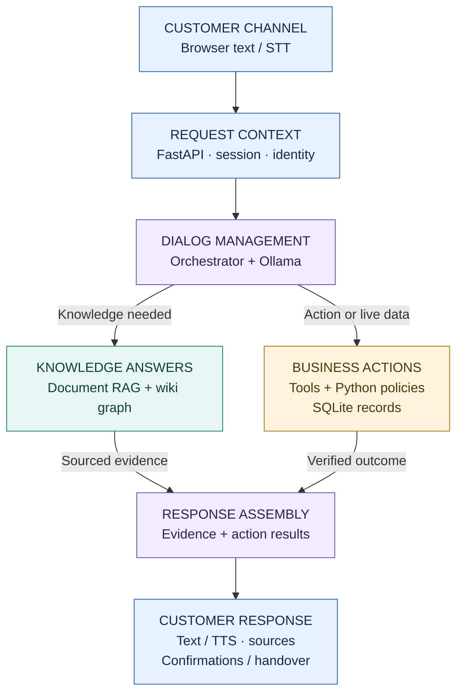
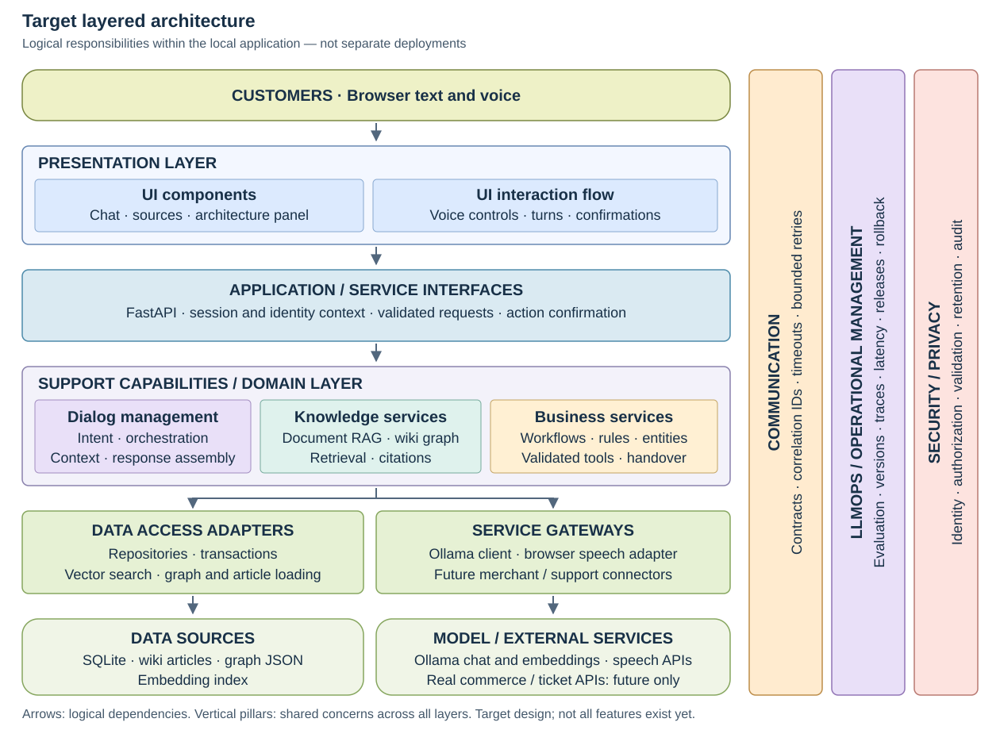
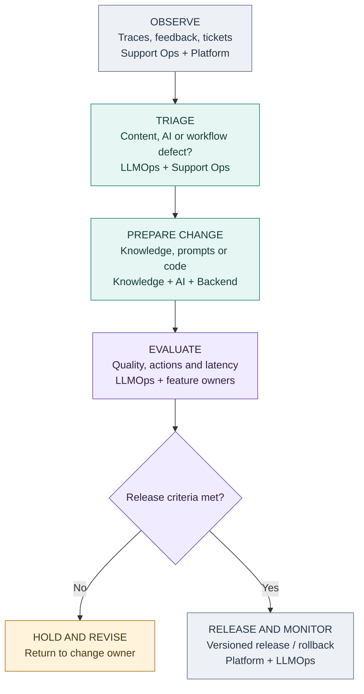
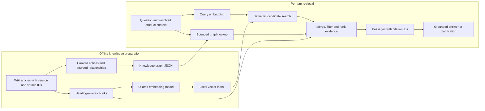
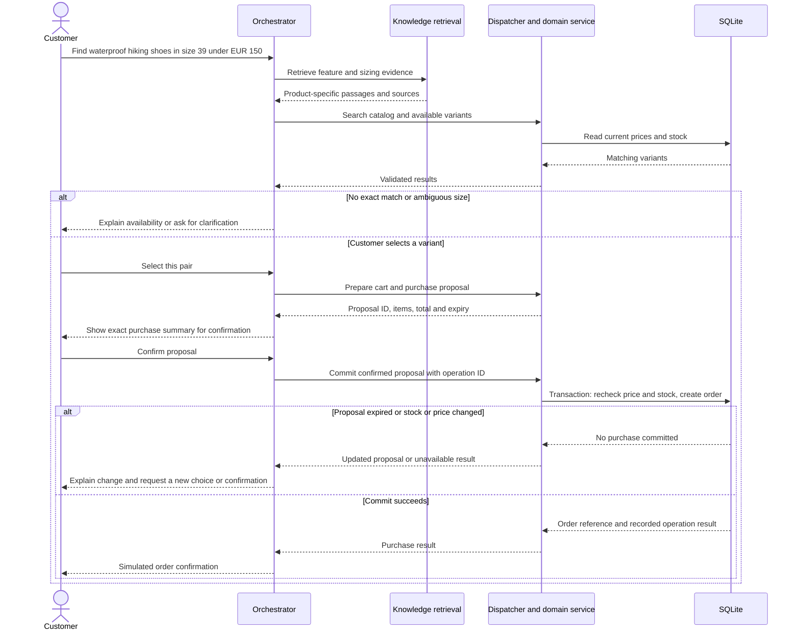
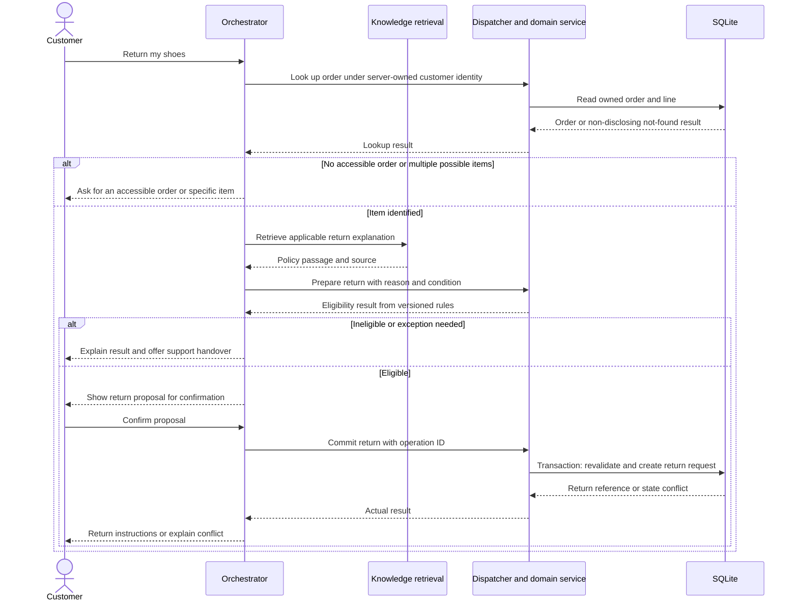
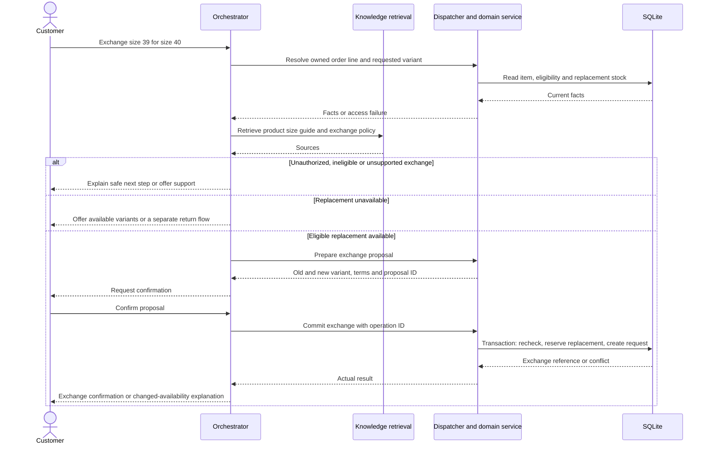
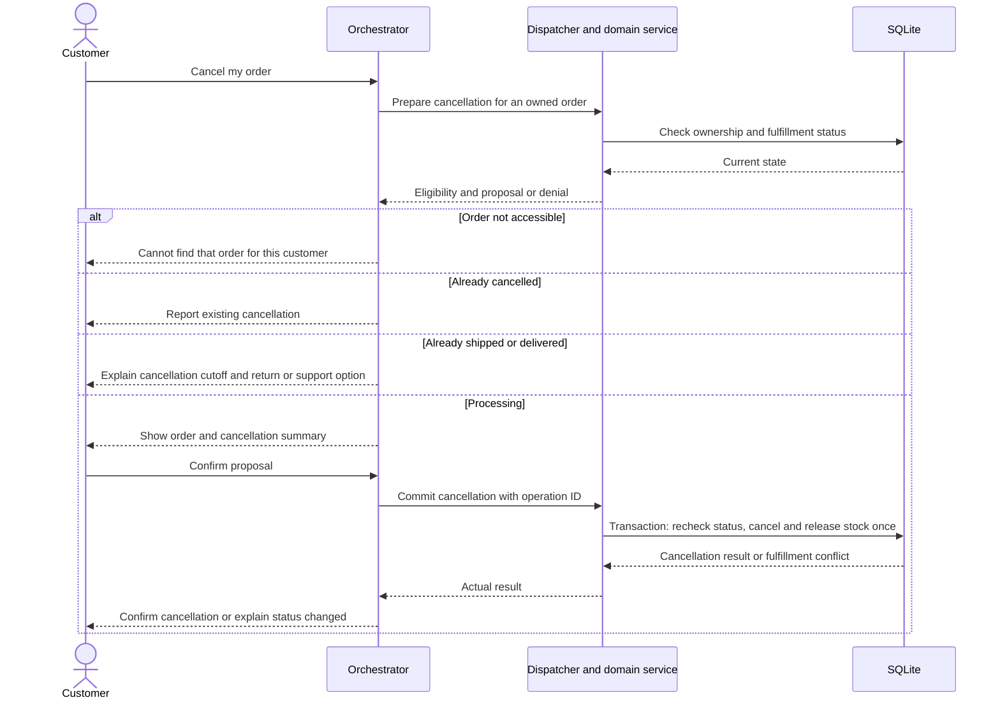

# Voice Agent Explorer — Architecture

## 1. Purpose and design status

Build a local customer-support demonstrator that makes the architecture of an
AI voice assistant understandable through working customer journeys and visible
execution traces. See [README.md](README.md) for the current application and
setup instructions.

**Principle: Use AI for ambiguity. Use deterministic software for certainty.**

The target follows the supplied “AI Voice Bot — Architecture Overview”:
channels, voice, identity, orchestration, retrieval, policy, tools, response,
handover, security, and observability. These are responsibilities inside a small
application, not a requirement to build separate microservices or install every
vendor in the reference image.

**Design status:** the online-shop domain and buying, returning, exchanging,
and cancelling journeys are agreed directions. **Stepwise Shoes**, a fictional
footwear shop, is the working proposal and still needs user confirmation.
All shop data and policies below are proposed demo fixtures, not real merchant
terms or legal guidance. Sections describing the target are plans, not features
already implemented. This documentation implements issue #11 only.

### Current versus target

| Area | Current implementation | Target |
| --- | --- | --- |
| UI | Browser text chat with loading/error/retry feedback | Text and voice, sources, action confirmations, architecture panel |
| Backend | FastAPI serves `/`, `/static`, `/health`, `/chat` | Session-aware chat and controlled domain services |
| Agent | Explains voice-AI concepts using Ollama | Customer-support orchestration with retrieval and bounded tool calls |
| State | One shared in-memory history with a lock | Isolated sessions and persisted demo business records |
| Model | Ollama `llama3.2:3b` | Same initial chat model, evaluated for structured tool proposals |
| Knowledge | No retrieval pipeline | Document RAG and graph-assisted retrieval |
| Actions | None | Simulated purchase, return, exchange, cancellation, and support ticket |

## 2. Bounded business scenario

Proposed catalog: six fictional products across everyday, running, and hiking
footwear, from two fictional brands with distinct size guides. Seed a limited
set of EU size/colour variants rather than every possible combination.

- One currency: EUR; prices stored as integer cents.
- One shipping region and fixed shipping terms; simulated checkout only.
- A few demo customers and orders in processing, shipped, delivered, and
  cancelled states. No real payments, refunds, shipments, or merchant APIs.
- About 10–15 curated wiki-style articles, plus a graph with a few dozen nodes
  and relationships.
- Start with English text and voice; additional languages are an open decision.
- Purchases can include multiple cart lines. The first return/exchange workflow
  handles one order line and its full quantity, avoiding partial-quantity logic.
- Exchanges change size/colour within the same product and price. Cross-product
  or different-price exchanges go to demo support.
- Phone/mobile adapters, production login, streaming full-duplex audio, and
  physical warehouse processing are later extensions.

## 3. Graphical design

Flow and sequence diagrams use fenced `mermaid` blocks, which GitHub renders
in Markdown files. The layered view uses a repository-local SVG to preserve
horizontal tiers and full-height vertical pillars reliably.
The current diagram is separate from the planned diagrams to avoid implying
that the target is already running. Solid arrows show calls or data flow;
dotted arrows show cross-cutting controls or telemetry. Each sequence describes
a logical flow, not a separate deployment per participant.

### 3.1 Current implementation

### 3.2 Target runtime — customer request to response

Read from top to bottom. The two middle branches are optional capabilities:
knowledge questions use retrieval; order actions use business services; a turn
may use both. Each box groups related responsibilities to keep the overview
readable. The sequence diagrams below show the detailed calls and returns.

**Reading the overview:** dialog management and response assembly are two stages
of the same orchestrator, not separate agents. Simple clarification can go
straight to response assembly without either capability; that shortcut is
omitted to avoid a long crossing arrow. Knowledge retrieval does not execute
business actions, and the model cannot bypass the policy/dispatcher boundary.

A state-changing proposal returns to the customer for explicit confirmation.
The confirmation endpoint then invokes the deterministic commit service with
fresh policy checks; it does not ask the LLM for permission. Support handover is
also a confirmed business tool that records a local ticket, available from any
journey. The four sequence diagrams show these multi-turn interactions.

**Across every stage:** enforce session ownership, validate untrusted input,
and emit sanitized trace events. These controls are shown as vertical pillars in
the layered view instead of drawing an arrow to every runtime box.

### 3.2.1 Layered architecture and ownership

This view follows a conventional layered layout: horizontal tiers contain
application components, with vertical pillars for concerns shared across the
entire stack. It describes responsibility and dependency, **not the order in
which a request executes**. Arrows point toward supporting capabilities; they
do not mean every request visits every layer.

Team names represent roles in a larger company. In this local project one
developer can perform several roles; these labels do not require new services
or an actual multi-team organization.

[Open the full-size layered diagram](docs/diagrams/layered-architecture.svg).
The SVG is editable source stored in the repository; it needs no image build
step and uses no external fonts, scripts, or assets.

| Horizontal tier | Contents | Primary owners |
| --- | --- | --- |
| Presentation | Chat/source/trace UI, voice interaction, confirmation controls | Frontend / UX |
| Application / service interfaces | FastAPI contracts, session context, request validation, confirmation endpoint | Backend |
| Support capabilities / domain | Dialog orchestration, RAG/graph knowledge services, business workflows/rules/entities | Applied AI + Knowledge / Data + Backend; Support Operations owns policy meaning |
| Data access adapters | Repositories, transaction handling, vector search and graph/article loading | Backend + Knowledge / Data |
| Service gateways | Model and speech adapters; future commerce/support API connectors | Backend + Applied AI + Frontend for browser speech |
| Data sources and services | SQLite, wiki, graph/index files, Ollama and speech providers | Data + Backend + Platform |

The gateways are logical integration boundaries: browser speech remains in the
frontend and does not travel through a backend proxy. SQLite-backed demo tools
implement business workflows locally; real commerce/ticket APIs are explicitly
future integrations. The domain owns eligibility and workflow decisions; data
adapters implement the transactions and persistence those decisions require.

**Vertical pillars:**

- **Communication:** consistent API/tool contracts, correlation IDs, timeouts,
  and bounded retry behavior. Backend coordinates this with all adapter owners.
- **LLMOps / operational management:** quality evaluation, model/prompt/index
  versions, trace collection, latency, releases, incidents, and rollback.
  LLMOps leads AI quality; Platform/SRE leads runtime reliability.
- **Security / privacy:** identity, authorization, validation, data retention,
  and audit requirements. Security sets boundaries with the teams implementing
  each layer.

These pillars apply throughout the stack. They are not sequential processing
steps or separate servers. Team ownership is detailed below rather than packed
into the graphical boxes.

#### Responsibility matrix

| Team / role | Owns | Main collaboration / boundary |
| --- | --- | --- |
| Product / Support Operations | Customer journeys, service policy meaning, escalation criteria and acceptance examples | Approves shop rules and handover content; does not delegate policy authority to the model |
| Frontend / UX | Accessible chat/voice UI, confirmation controls, source and trace presentation | Uses backend contracts; never treats a visual success state as proof of a committed action |
| Backend / Domain Engineering | Sessions, ownership enforcement, tool contracts, transactions, idempotency and business rules | Implements Support Operations policies; returns authoritative action outcomes |
| Applied AI Engineering | Prompt design, intent/entity interpretation, orchestration strategy and retrieval/ranking behavior | Works with Backend on validated tool proposals and with LLMOps on quality regressions |
| Knowledge / Data Engineering | Article ingestion, chunking, graph schema/provenance, index builds and metadata validation | Support subject-matter experts approve content; Applied AI evaluates retrieval relevance |
| LLMOps / AI Quality | Evaluation datasets/runs, prompt-model-index version tracking, quality monitoring, release comparisons and rollback criteria | Coordinates AI changes with Applied AI, Knowledge and Platform; does not own merchant policy or bypass action checks |
| Platform / SRE | Model serving, application availability, deployment, resource use, backups and operational alerts | Supplies runtime telemetry and deployment mechanisms; collaborates with LLMOps on latency and model incidents |
| Security / Privacy | Access-control requirements, retention boundaries, audit design and threat review | Works across all layers; feature teams implement and test the controls |

QA can be a shared role across these teams: Backend verifies action correctness,
Knowledge/Applied AI verify evidence quality, LLMOps maintains regression runs,
and Support Operations reviews whether outcomes solve the customer's problem.

### 3.2.2 LLMOps and knowledge improvement cycle

This is the **offline improvement path**, separate from the customer request
path. It adapts the feedback/knowledge-maintenance idea in the reference image
to our local stack. FastAPI fills the application-server role, and SQLite plus
demo tools fill the business/ticket-system role; Node.js and ServiceNow are not
dependencies of this design.

After release, new observations start another cycle; a held change returns to
its owner. Those feedback loops are described here rather than drawn as long
return arrows. Review/redact ticket material before it becomes knowledge or an
evaluation fixture. Resolved tickets are candidates for curated articles, not
automatically authoritative sources.

The initial project improves retrieval, prompts, and rules through reviewed
changes and repeatable evaluation. It does **not** automatically retrain the
LLM from customer conversations. Policy changes require Support Operations
approval and synchronized policy prose/rule versions. LLMOps measures whether
changes improve the system; Platform executes the release/rollback mechanism.

### 3.3 Target knowledge ingestion and retrieval

Graph edges locate relevant documents; the article passages supply the evidence
for explanations. Stock, prices, ownership, order state, and eligibility are
queried through business tools, not embedded as authoritative knowledge.

### 3.4 Purchase sequence — target

### 3.5 Return sequence — target

Creating a return request does not mean the item has arrived or a refund was
paid. The response must distinguish those states.

### 3.6 Exchange sequence — target

An exchange reserves replacement stock. It does not imply that replacement
shipping or inspection of the original pair has occurred. Demo resets clear
these reservations along with the corresponding requests.

### 3.7 Cancellation sequence — target

For all four sequences, a tool timeout produces an unknown/pending outcome,
not an invented success. Resolve the same operation ID before retrying a write;
offer a ticket if the outcome cannot be determined. Detailed rules follow.

## 4. Component responsibilities and proposed stack

| Component | Initial target choice | Boundary and tradeoff |
| --- | --- | --- |
| Channels/UI | Existing HTML/CSS/JavaScript | One browser application; text always available |
| Voice adapter | Browser speech recognition and speech synthesis | Feature-detect; browser-dependent support and possible remote speech processing |
| API/orchestrator | Existing Python/FastAPI; small modules | Coordinates stages; no agent framework required |
| Chat model | Ollama `llama3.2:3b` initially | Evaluate tool-schema accuracy; alternate local model only if needed |
| Embeddings | Proposed Ollama `nomic-embed-text` | Separate download; not a current dependency; use model-specific query/document formatting |
| Vector retrieval | Local embedding matrix and cosine similarity, proposed NumPy | Suitable for a tiny corpus; rebuild when embedding model or chunking changes |
| Wiki | Markdown files with structured metadata | Curated, versioned source of explanatory knowledge |
| Graph | JSON nodes/edges and bounded Python traversal | Easy to inspect and test; no graph database at this scale |
| Business state | SQLite via Python standard library | Transactions and constraints for local demo writes |
| Policy | Typed Python rules and versioned fixture configuration | Never replaced by model judgment or retrieved instructions |
| Telemetry | Structured events, bounded local storage, UI panel | No external monitoring platform needed initially |

### Voice and turn lifecycle

Target states: idle → listening → transcribing → thinking → speaking → idle,
with recoverable error paths. Use a stop-speaking control and cancel TTS when
a new microphone turn starts. Track turn IDs so a late response cannot start
audio over a newer turn. Stopping speech does not cancel an already committed
business action.

Browser end-of-speech detection approximates turn handling; it is not custom
audio-level VAD. Full-duplex barge-in, streaming STT/TTS, and phone integration
remain later work. Microphone denial or unsupported speech APIs must leave text
chat usable. Fully offline voice is not guaranteed with browser recognition.

### Orchestration

The model interprets product preferences, ambiguous language, and follow-up
references; it can propose a structured tool name and arguments. The dispatcher
validates these against an allowlist and typed schema. Use a bounded loop
(initial proposal: at most four tool steps per turn) and one repair attempt for
malformed model output, then clarification or handover.

Model output never supplies trusted customer identity or permission grants.
Deterministic handlers can answer known status/confirmation steps directly;
not every stage requires a model call. Do not claim that a transaction succeeded
unless a domain service reports its persisted result.

## 5. Document RAG and wiki/knowledge graph

### Sources and ingestion

Articles have stable IDs, title, language, version, product/brand scope, policy
version where applicable, effective dates, and active/superseded status. Each
chunk retains its article ID, heading, version, and source path. Split by
headings and bounded passage size; preserve enough context to interpret rules.

An ingestion manifest records source hashes, chunking version, embedding model,
and index version. Rebuild or invalidate stale indexes when these change.
Validate missing links, duplicate IDs, and unsupported relation types before
loading a graph/index version.

### Graph model

Node types: `Product`, `Brand`, `Category`, `Feature`, `SizeGuide`, `CareGuide`,
`Policy`, and `Article`. Example relationships:

- Product `made_by` Brand; Product `in_category` Category.
- Product `has_feature` Feature; Product `uses_size_guide` SizeGuide.
- Product `has_care_guide` CareGuide; Product `covered_by` Policy.
- Guide or policy `documented_in` Article.

Every factual edge includes a supporting article/version reference. Product
nodes link to stable catalog IDs, while mutable stock and pricing remain in
SQLite. Keep customer identities and private orders out of the public knowledge
graph. This is graph-assisted RAG over curated links, not automatic extraction
of an enterprise-wide graph or an implementation of a particular GraphRAG
framework.

### Per-turn retrieval

1. Resolve product IDs/aliases using catalog facts and conversation context.
   Ask when multiple products match instead of silently choosing one.
2. Embed the question and retrieve semantic candidates (initial top 8).
3. In graph-assisted mode, follow allowed relationships from resolved entities
   for at most two hops and add linked article candidates (bounded to 20).
4. Filter by language, product scope, and applicable document/policy version.
   For an order workflow, the domain service supplies the applicable policy
   version; do not silently replace purchase-time terms with today's policy.
5. Deduplicate and rank candidate passages using semantic relevance and exact
   scope/link matches; initially include at most five passages in model context.
6. Answer with source IDs resolved by the server into real document references.
   Validate that returned citation IDs belong to retrieved evidence. Evaluate
   support for the claims separately; valid IDs alone do not prove grounding.

These retrieval limits are starting settings to tune through evaluation, not
quality guarantees. With no sufficient evidence or conflicting active sources,
ask for clarification, say what is unknown, or offer support. Never turn a
similarity score into an uncalibrated claim of confidence.

**Three authorities:** passages support explanations; graph links identify
relevant information; domain services decide live availability and action
eligibility. Policy prose and executable rules share version IDs and fixture
tests to detect disagreement. On disagreement, do not let the model override
the rule; explain the unresolved issue and offer support.

## 6. Sessions, entities, and interface contracts

The following are proposed contracts for future issues. The current API remains
`POST /chat` with `{"message": "..."}` → `{"response": "..."}`.

### Session and identity

Target: an opaque server-issued session cookie, per-session conversation state,
and a server-owned binding to a seeded demo customer. An explicit local-only
demo selector can establish that binding and clears previous customer context
when switched. This is simulated identity, not production authentication.
Before any public deployment, replace it with verified authentication.

Do not accept `customer_id` from model tool arguments as authority. Every
private lookup and write is scoped to the customer in server context. Session
IDs alone must not grant another customer's access. Serialize turns within a
session while allowing independent sessions to progress.

### Core data model

| Entity | Important fields and invariants |
| --- | --- |
| Session | Opaque ID, demo customer binding, history, pending proposal, last activity |
| Customer | Seeded ID and synthetic profile; no real payment or identity data |
| Product / Variant | Stable IDs, brand/category, SKU, size, colour, current price in cents |
| Inventory | Variant ID, on-hand and reserved quantities; available stock cannot be negative |
| Cart / CartLine | Customer-owned variant/quantity selection; not a stock guarantee |
| Order / OrderLine | Customer, fulfillment state, immutable item/price snapshots, policy version, delivery time |
| ActionProposal | ID, owner, action/payload hash, versioned quote, expiry, confirmation/consumption status |
| Operation | Stable idempotency key, owner, action/payload hash, status, persisted result |
| ReturnRequest | Owned order line, reason/condition, policy version, state, reference |
| ExchangeRequest | Owned original line, replacement variant, reserved quantity, state, reference |
| SupportTicket | Owner, reason, minimal summary, related order/operation, local reference |
| Article / Chunk | Source IDs, version, heading, scope, effective dates and embedding reference |
| GraphNode / GraphEdge | Typed identifiers/relationships, source/version provenance |
| Trace / Event | Turn ID, stage, duration, safe status and evidence/tool references |

Store timestamps in UTC; use an injectable clock for rule tests. Orders preserve
the policy version applicable to the purchase. For the demo, fulfillment changes
are seeded or simulated by fixtures rather than a warehouse integration.

### Proposed public API

| Endpoint | Contract |
| --- | --- |
| `POST /sessions` | Establish anonymous or explicit local demo-customer session; issue cookie |
| `POST /chat` | Accept `message` plus client turn ID; resolve context from cookie |
| `POST /actions/{proposal_id}/confirm` | Record explicit confirmation and execute once using the proposal's operation ID |
| `POST /sessions/reset` | Clear this session's history and pending proposals, not its persisted orders |
| `GET /traces/{trace_id}` | Return a sanitized trace only to its owning session |

The target chat response retains `response` and adds `turn_id`, `trace_id`,
`sources`, `action_proposal`, and `action_result` as needed. A proposal displays
exact items, quantities, totals or terms, expiry, and a confirmation control.
Initially confirm business writes with that control; voice interpretation may
prepare an action but cannot fabricate the confirmation event.

### Tool and service contracts

Read tools: `search_products`, `get_product`, `get_order`, and
`get_operation_status`. Proposal tools: `prepare_purchase`, `prepare_return`,
`prepare_exchange`, `prepare_cancellation`, and `prepare_handover`.
Confirmation invokes a deterministic commit service; it is not an unrestricted
model tool.

Each call receives a validated argument model and server context containing
customer/session/turn IDs. Structured results use a status such as `ok`,
`needs_input`, `denied`, `conflict`, `unavailable`, or `pending`, a stable code,
safe data, and an optional operation/reference ID. Examples include
`OUT_OF_STOCK`, `ORDER_NOT_FOUND`, and `RETURN_WINDOW_EXPIRED`. The model must
not turn these into successful outcomes.

## 7. Deterministic workflow rules

Initial demo policy proposal: returns/exchanges within 30 days of recorded
delivery, with unworn items in original packaging. This is a fixture to approve,
not a statement of consumer law. The service records self-reported condition;
physical inspection and actual refunds are outside this demo.

| Journey | Required checks at commit | Persisted effect |
| --- | --- | --- |
| Buy | Owned cart, positive quantities, current stock, unchanged accepted quote, valid confirmation | Create processing order and reserve stock atomically |
| Return | Owned delivered line, policy window and reported condition, no conflicting return/exchange | Create return request; no automatic refund or restock |
| Exchange | Return-like eligibility plus same-product/equal-price replacement and stock | Reserve replacement and create exchange request atomically |
| Cancel | Owned processing order, unchanged eligible state | Mark cancelled and release its reservation exactly once |

Read checks happen before showing a proposal; commit checks happen again in the
same transaction as the write. When a quote, variant, or action changes, expire
the old confirmation and require a new proposal. Initial proposal lifetime:
five minutes, tested with an injectable clock.

Idempotency uses a stable operation ID per proposal, a payload hash, and a
database uniqueness constraint. The same ID/payload returns the recorded
result; the same ID with a different payload is rejected. A new ID must still
respect business uniqueness (for example, no second active return for a line).
Transactions prevent competing purchases/exchanges from over-reserving stock.

On an uncertain write result, query the operation record or repeat the same
idempotent operation. Do not create a fresh operation automatically. Retry only
transient read failures, at most twice; validation, authorization, and business
denials are not retried. A browser timeout does not prove the backend stopped.

## 8. Fallback, security, and observability

### Failure and handover behavior

| Situation | User-facing behavior |
| --- | --- |
| Ambiguous product, order, or request | Ask a targeted question before preparing an action |
| Missing/conflicting knowledge | State the gap and offer a support ticket; do not invent policy |
| Unavailable variant | Explain stock result; offer alternatives without silently substituting |
| Denied action or inaccessible order | Explain only safe information; offer an allowed next step |
| Expired proposal or changed order state | Refresh facts and request a new confirmation if needed |
| Model/API failure | Keep transcript usable, preserve input, and offer retry |
| Unknown write outcome | Show pending status and resolve operation ID before retrying |
| User asks for a person or automation cannot resolve | Prepare a minimal handover summary for confirmation |

A confirmed handover creates a local ticket containing the request, relevant
order/operation references, unresolved issue, and steps already attempted.
Return its actual ticket reference and label it as a demo queue. No email,
callback, human response time, or live transfer is promised.

### Security and governance boundaries

- Treat user text, wiki content, and tool-returned strings as untrusted input,
  never as instructions that can change tools, identity, or permissions.
- Validate schemas, allowlist tools and graph relationships, bound retrieval
  and tool loops, and enforce ownership in services.
- Serve UI/API on the same origin. Cookie-based state-changing endpoints need
  origin/CSRF protections; use appropriate cookie flags for deployment.
- Render chat safely as text; sanitize any future rich-text rendering and
  resolve source links through trusted source IDs.
- Use synthetic demo data. Do not place secrets or raw customer transcripts in
  traces by default. Audit action IDs/outcomes without hidden model reasoning.
- Target retention: expire inactive in-memory sessions after 30 minutes;
  keep sanitized local traces at most 24 hours with a size cap; persist demo
  business data until an explicit reset. Document reset behavior when built.
- Source/version provenance, retention, and access checks demonstrate controls;
  they do not constitute GDPR or EU AI Act compliance certification.

### Architecture panel and traces

Show actual events, including skipped stages, rather than an animation implying
every component ran. Example: session resolved → retrieval completed → policy
denied → response ready. Each turn has a trace ID and stage durations; events
include retrieval source IDs and graph paths, policy version/reason codes,
tool result/operation IDs, model duration, and errors. The panel must not expose
other customers' data, full prompts, or private chain-of-thought.

Measure backend response time separately from browser speech recognition and
time to first spoken output. Record failures and latency without assuming local
models expose reliable token or monetary-cost metrics.

## 9. Reuse across businesses

Keep reusable capabilities separate from the shop domain without building a
generic configuration framework in advance.

| Shared capability | Shop-specific implementation |
| --- | --- |
| Session/voice/trace handling | Seeded customers and shop terminology |
| Retrieval and source contracts | Footwear wiki, size guides, graph vocabulary |
| Tool dispatch and confirmation lifecycle | Purchase/return/exchange/cancel tools |
| Policy execution boundaries | Eligibility windows, fulfillment and stock rules |
| Handover contract | Shop ticket summary and routing categories |

Future implementation may introduce focused modules for sessions, retrieval,
graph traversal, tool dispatch, shop services, policy, storage, and tracing as
their issues require them. These modules do not exist yet. Another business
would replace knowledge, rules, tools, and fixtures while retaining orchestration
contracts; changing only the system prompt would not be sufficient.

## 10. Evaluation and implementation roadmap

### Retrieval evaluation

Use a fixed, versioned question set with expected product scope, supporting
article IDs, and answerable/unanswerable labels. Compare document RAG alone
against the same pipeline with graph expansion enabled, holding corpus,
embedding model, chat model, and answer budget constant.

Include correct-product guides, cross-brand sizing, paraphrased features,
superseded policies, ambiguous products, missing information, and malicious
instructions embedded in a document. Measure evidence recall in the final
context, correct scope/version selection, citation support, appropriate
abstention, latency, and graph expansion size. Human review checks factual
support; schema-valid citations alone are insufficient. Report results honestly
even if graph expansion adds latency without improving a particular question.

### Ordered milestones for subsequent GitHub issues

Each milestone keeps the app runnable and adds its own relevant tests. These
are proposed issue scopes, not already-created issues or delivered features.

| Order | Milestone and dependencies | Acceptance criteria |
| --- | --- | --- |
| 1 | Session isolation and demo identity | Two sessions never mix history; customer switching clears context; reset/expiry affect only the owning session; private fixture lookup enforces ownership |
| 2 | Browser voice loop; depends on 1 | Speak and hear a turn in a supported browser; denied/unsupported microphone falls back to text; stop/new turn cancels playback; stale responses do not speak |
| 3 | Structured traces and initial panel; depends on 1 | Display real stage durations/status per turn; trace access is session-scoped; redact sensitive content and verify retention limits |
| 4 | Catalog, SQLite fixtures, and wiki foundation; depends on 1 | Reproducible seed/reset; six proposed products and owned orders; stock/price lookup uses DB; metadata and source links validate |
| 5 | Document RAG baseline; depends on 3–4 | Build/rebuild versioned index; cite supporting passages; handle unknown/conflicting sources; record baseline evaluation results |
| 6 | Knowledge graph and graph-assisted RAG; depends on 5 | Validate edge provenance; traverse within bounds; show graph paths; compare against baseline using the same evaluation set |
| 7 | Confirmed purchase workflow; depends on 4–6 | Typed tool dispatch and confirmation; transactional stock reservation; changed quote needs reconfirmation; concurrent/repeated submissions create no duplicate purchase |
| 8 | Cancellation workflow; depends on 7 | Processing order cancels once; shipped/delivered order is denied; ownership and fulfillment races tested; release inventory exactly once |
| 9 | Return workflow; depends on 7 | Policy-version and boundary-date tests; owned delivered item required; duplicate requests prevented; response distinguishes request from refund |
| 10 | Exchange workflow; depends on 9 | Validate replacement and eligibility; reserve stock atomically; prevent conflicting return/exchange; handle unavailable and different-price replacements |
| 11 | Handover and integrated fallback; depends on 8–10 | Confirmed local ticket with minimal context and real reference; all journeys can reach support; unknown operations resolved without duplicate writes |
| 12 | Portfolio acceptance scenarios; depends on 2–3 and 6–11 | Demonstrate all four journeys, sources/graph paths/policy events, voice fallback, denied actions and service failures; publish repeatable evaluation results |

Security checks, error handling, and relevant telemetry ship with each feature;
they are not postponed to the final milestone. Tests should include expired
confirmations, two buyers competing for the last pair, timeout after commit,
and attempted access to another demo customer's order.

### Open decisions before feature implementation

1. Confirm Stepwise Shoes and the initial language, currency, and shipping region.
2. Approve catalog fixtures and exact demo return/exchange/shipping terms.
3. Evaluate `llama3.2:3b` for tool proposal accuracy and `nomic-embed-text` for
   the selected language/corpus; adjust only with evidence.
4. Choose concrete chunk sizes, ranking weights, trace size cap, and latency
   targets after measuring the local machine and corpus.
5. Select the first browser for speech acceptance checks; decide later whether
   fully local speech processing is a requirement.

## 11. Documentation verification

Check diagram syntax and rendering, local links, API examples, and setup/test
commands against the repository. Preview Mermaid on GitHub when the branch is
published, since GitHub's renderer version may differ from local Mermaid.
This issue changes documentation only; implementation dependencies above must
not be installed into the project until their feature issues require them.
